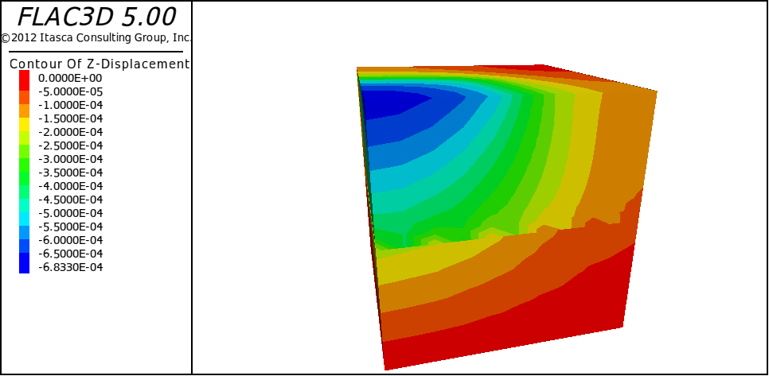
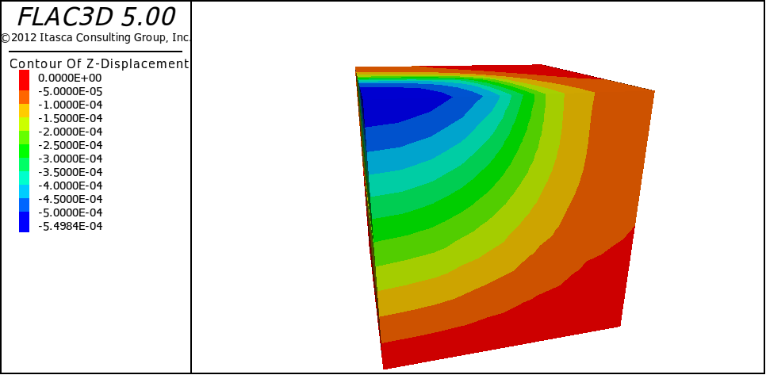
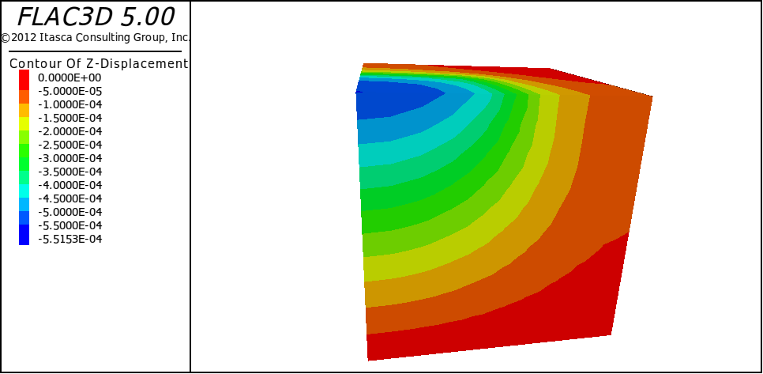
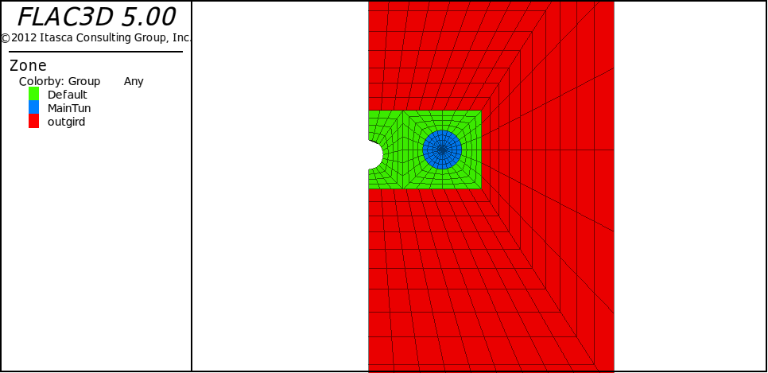

### 中级实体建模术

1.  组合基本网络
    
    1) 5-1
    
    ```
    ;圆柱体外环绕放射状网格
    generate zone radcyliner size 4 25 6 14 ratio 1 1 1 1.2 &
    p0 0 0 0 p1 50 0 0 p2 0 100 0 p3 0 0 50 &
    dimension 2 2 2
    ;平行六面体环绕放射状网格
    generate zone radtunnel size 4 25 4 14 ratio 1 1 1 1.2 &
    p0 0 0 0 p1 0 0 -50 p2 0 100 0 p3 50 0 0 &
    dimension 1.8 2 2
    ;镜像网格
    generate zone relect normal -1 0 0 origin 0 0 0
    ```

2. 连接比邻的网格
    
    1) 5-2
    
    ```
    new
    generate zone brick size 5 5 5 &
    p0 0 0 0 p1 10 0 0 p2 0 10 0 p3 0 0 5
    generate zone brick size 10 10 10 &
    p0 0 0 5 p1 10 0 5 p2 0 10 5 p3 0 0 10
    attach face range z 4.9 5.1
    model elastic
    property bulk 8e9 shear 5e9
    fix x range x -0.1 0.1
    fix x range x 9.9 10.1
    fix y range y -0.1 0.1
    fix y range y 9.9 10.1
    fix z range z -0.1 0.1
    apply szz -1e6 range z = 9.9 10.1 x 0 5 y 0 5
    history unbal
    solve
    ```

    2) 5-3
    
    ```
    new
    generate zone brick size 5 5 5 &
    p0 0 0 0 p1 10 0 0 p2 0 10 0 p3 0 0 5
    generate zone brick size 10 10 10 &
    p0 0 0 5 p1 10 0 5 p2 0 10 5 p3 0 0 10
    attach face range z 4.9 5.1
    model elastic
    property bulk 8e9 shear 5e9
    fix x range x -0.1 0.1
    fix x range x 9.9 10.1
    fix y range y -0.1 0.1
    fix y range y 9.9 10.1
    fix z range z -0.1 0.1
    apply szz -1e6 range z = 9.9 10.1 x 0 5 y 0 5
    history unbal
    solve
    ```
    3) 5-4

    ```
     new
    generate zone brick size 10 10 10 &
    p0 0 0 0 p1 10 0 0 p2 0 10 0 p3 0 0 10
    model elastic
    property bulk 8e9 shear 5e9
    fix x range x -0.1 0.1
    fix x range x 9.9 10.1
    fix y range y -0.1 0.1
    fix y range y 9.9 10.1
    fix z range z -0.1 0.1
    apply szz -1e6 range z = 9.9 10.1 x 0 5 y 0 5
    history unbal
    solve
    ```
3. 简化复杂网格为基本网格
    
    1) 5-5
    
    ```
    new
    generate zone radcylinder p0 15 0 0 p1 23 0 0 &
    p2 15 50 0 p3 15 0 8 &
    size 4 10 6 4 dim 4 4 4 4 &
    rat 1 1 1 1 fill group MainTun
    generate zone reflect dip 90 dd 90 origin 15 0 0
    generate zone reflect dip 0 origin 0 0 0
    generate zone radcylinder p0 0 0 -1 p1 7 0 0 &
    p2 0 50 -1 p3 0 0 8 p4 7 50 0 p5 0 50 8 &
    p6 7 0 8 p7 7 50 8 p8 3 0 -1 p10 3 50 -1 &
    size 3 10 6 4 dim 3 3 3 3 rat 1 1 1 1
    generate zone radcylinder p0 0 0 -1 p1 0 0 -8 &
    p2 0 50 -1 p3 7 0 0 p4 0 50 -8 p5 7 50 0 &
    p6 7 0 -8 p7 7 50 -8 p9 3 0 -1 p11 3 50 -1 &
    size 3 10 6 4 dim 3 3 3 3 rat 1 1 1 1
    sel shell range cylinder end1 0 0 -1 end2 0 50 -1 radius 3
    generate zone radtunnel size 9 10 3 10 &
    p0 0 0 0 p1 50 0 0 p2 0 50 0 p3 0 0 50 &
    dim 23 8 23 rat 1 1 1 1.1 &
    group outgird
    generate zone reflect normal 0 0 -1 origin 0 0 0 &
    range group outgird
    ;group servic range cylinder end1 0 0 -1 end2 0 50 -1 radius 3
    ```








