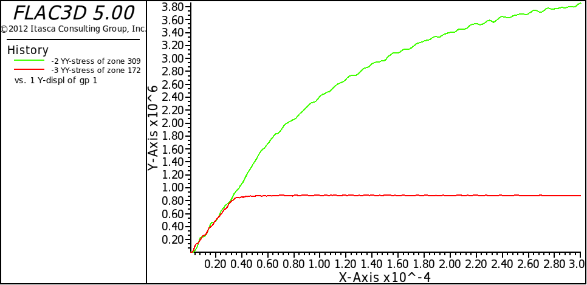
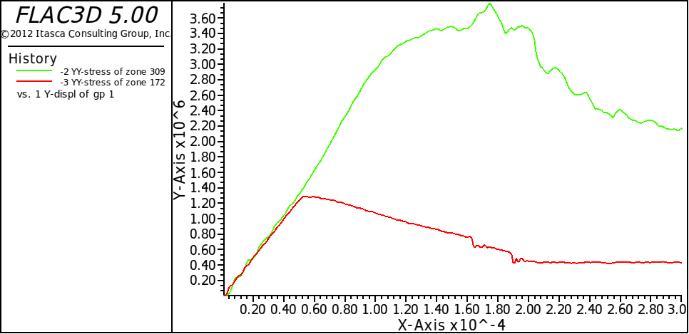
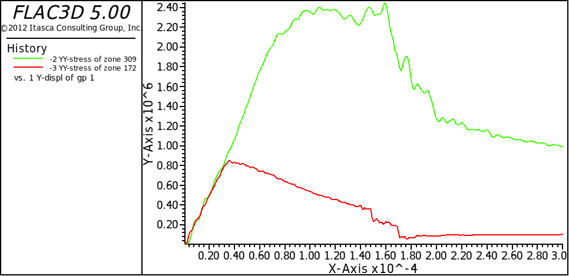

# 本构模型

1. 本构模型分类

    1) 空模型 model null range ...
    
    2) 弹性模型 
        - 各向同性
        - 正交各向异性
        - 横向同性
    
    3) 塑形模型
        - 德鲁克-普拉格模型（D-P模型）
        - 摩尔-库伦模型
        - 应变硬化/软化模型
        - D-Y模型
        - 修正剑桥模型
        - 多节理模型

2. 定义模型命令

   ```
   model <关键字> [overlay n] [range ...]
   model <load 文件名>  [overlay n] [range ...]
   ```

   1) 7-1

   ```
    new
    gen zone cyl p0 0 0 0 p1 1 0 0 p2 0 2 0 p3 0 0 1 size 4 5 4
    gen zone reflect norm 1 0 0
    gen zone reflect norm 0 0 1
    model mohr
    prop bulk 1.19e10 shear 1.1e10
    prop coh 2.72e5 fric 44 ten 2e5
    fix x y z range y -.1 .1
    fix x y z range y 1.9 2.1
    ini yvel 1e-7 range y -.1 .1
    ini yvel -1e-7 range y 1.9 2.1
    ini pp 1e5
    hist gp ydisp 0 0 0
    hist zone syy 0 1 0
    hist zone syy 1 1 0
    step 3000
   ```

   2) 7-2

   ```
    new
    gen zone cyl p0 0 0 0 p1 1 0 0 p2 0 2 0 p3 0 0 1 size 4 5 4
    gen zone reflect norm 1 0 0
    gen zone reflect norm 0 0 1
    model st
    prop bulk 1.19e10 shear 1.1e10
    prop coh 2.72e5 fric 44 ten 2e5
    prop ctab 1 ftab 2
    table 1 0 2.72e5 1e-4 2e5 2e-4 1.5e5 2e-4 1.03e5 1 1.03e5
    table 2 0 44 1e-4 42 2e-4 40 3e-4 38 1 38
    fix x y z range y -0.1 0.1
    fix x y z range y 1.9 2.1
    ini yvel 1e-7 range y -0.1 0.1
    ini yvel -1e-7 range y 1.9 2.1
    hist gp ydisp 0 0 0
    hist zone syy 0 1 0
    hist zone syy 1 1 0
    step 3000
   ```






